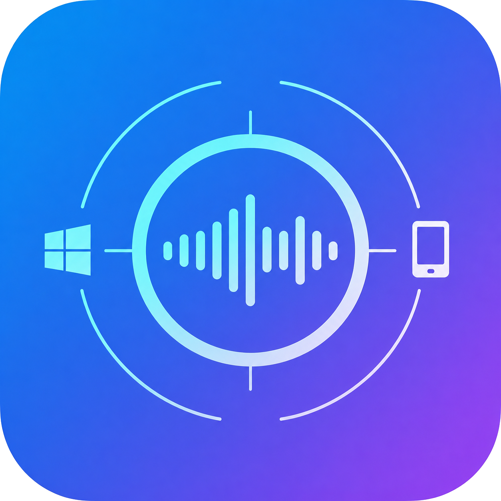

  

<h3>Audio Link</h3>

Audio Link 是一款局域网音频串流工具，可将 Windows 电脑正在播放的系统声音实时传输到 Android 设备。它支持自动发现、低延迟播放、缓冲调节，并可在手机端控制电脑音量与媒体播放。

 

---

## 开发背景

在我的使用环境中，Windows 对部分高阶蓝牙音频编码的支持并不理想，例如 aptX Lossless、aptX Adaptive 等编码无法像手机上一样方便地使用。而我的 Android 手机支持这些蓝牙编码，因此我希望把电脑音频先通过局域网串流到手机，再由手机发送给蓝牙耳机播放。

## 主要功能

- 局域网自动发现：桌面端通过 `_lan-audio._tcp.local.` 发布服务，Android 端可自动扫描可用服务端。
- 手动连接：当路由器、系统权限或网络环境限制 mDNS 时，可直接输入电脑 IP 和控制端口。
- 系统音频采集：Windows 端使用 WASAPI loopback 捕获默认输出设备的声音。
- 低延迟 UDP 播放：音频以 48 kHz、双声道、16-bit little-endian PCM 通过 UDP 传输。
- TCP 控制通道：用于启动/停止 UDP 串流、读取状态、控制电脑音量、静音和媒体键。
- 抖动缓冲：Android 端提供自动缓冲、自定义缓冲和关闭缓冲模式。
- 丢包恢复：UDP 包携带上一帧 PCM 冗余数据，客户端可在缺失上一包时尝试用 FEC 数据补帧。
- 播放统计：客户端显示收包、丢包、超时、缓冲、欠载和播放拉伸比例等诊断信息。
- 桌面托盘：电脑端可在托盘中启动/停止服务、打开本地管理页面、设置开机启动和退出程序。
- 本地管理页面：电脑端提供 `http://127.0.0.1:19092`，用于查看发送状态、WASAPI 触发间隔和音频引擎周期。
- 输出设备变化处理：Android 端可在耳机、蓝牙或扬声器输出变化时自动停止串流。
- 主题与偏好保存：Android 端支持跟随系统、浅色、深色主题，并保存连接与缓冲偏好。

## 使用方式

1. 在电脑上启动 Audio Link 桌面端，确认系统托盘中出现 `Audio Link`。
2. 确认电脑与 Android 设备连接到同一个局域网。
3. 如使用 Windows 防火墙或第三方安全软件，请允许电脑端接收局域网内的 TCP 控制连接，并允许 mDNS 与 UDP 音频通信。
4. 打开 Android 客户端，在“扫描”页等待自动发现服务端。
5. 点击发现到的服务端开始播放；如果没有发现服务端，切换到“手动”页输入电脑 IP，控制端口默认是 `9091`。
6. 串流开始后，电脑上正在播放的系统声音会通过 Android 前台服务播放。
7. 可在“电脑控制”页调整电脑音量、静音，以及发送上一曲、播放/暂停、下一曲等媒体按键。
8. 可在“日志”页查看播放统计，在“设置”页调整自动串流、输出设备变化处理和缓冲策略。

[LICENSE](LICENSE)
